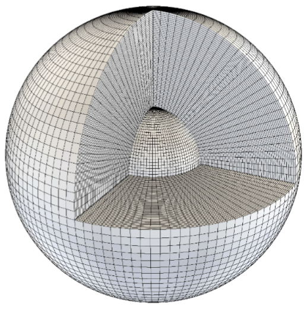

# Analysis documentation

## Overview

After generating each output, we can perform the data rate calculations necessary for each scene, with parameters that are given by the sensor. In order to do so, we need to voxelize the scene in spherical coordinates first, and then calculate $\Delta$, the data ratio based on our criteria for the data rate. $\Delta$ *directly influences the data rate required to process each scene, more on this later.*

### Calculations

From the paper that this work is based off on, we will define the following parameters:

- refresh rate of the assumed system $F$ (assumed constant)
- bits per measurement $b$ in the system's ADC converter (assumed constant)
- max signal-to-noise ratio ${SNR}_{\mathrm{max\ range}}$ (assumed constant)
- total range $R$ that the sensor covers in m (assumed constant)
- total azimuth $\theta$ that the sensor covers in degrees (assumed constant)
- total elevation $\phi$ that the sensor covers in degrees (assumed constant)
- range precision $\delta_{R}$ of our sensor in m (assumed constant)
- azimuth precision $\delta_{\theta}$ of our sensor in degrees (assumed constant)
- elevation precision $\delta_{\phi}$ of our sensor in degrees (assumed constant)
- Fraction or volume of occupied voxels $\Delta$, based on our criteria: *(this is the only variable that changes)*
  - Simple method: $\Delta = \frac{\mathrm{voxels\ occupied}}{\mathrm{total\ voxels}}$
  - Volumetric method: $\Delta = \frac{\mathrm{total\ volume\ of\ occupied\ voxels}}{\mathrm{total\ volume\ bounded\ by\ FOV}}$ *(more on this later.)*

With these parameters, the atomic norm data rate of our sensor is calculated using the formula:

$$\mathrm{Data\ rate}=\frac{R\theta\phi}{\delta_{R}\delta_{\theta}\delta_{\phi}}\frac{32Fb\Delta\log({\frac{1}{2\Delta}})}{3 {SNR}_{\mathrm{max\ range}}}$$

The derivation of this formula can be found in the paper.

### Voxelization

We will voxelize a scene, and then find which voxels within a particular scene are occupied. A voxel is considered as occupied if there is one or more points that are inside of the voxel; all or nothing. Think of each voxel as a $dV$ element in spherical coordinates, except that it isn't of infinitesmal size.

<details>
  <summary>An example of a spherical grid system, where each division would represent a voxel:</summary>



*Pretend that instead of a sphere, this solid is represented as a sensor FOV with a similar grid shown above.*

</details>
<br>

#### Methodology for voxelization

The process to voxelize our point cloud is as follows:

1. Convert our point cloud to spherical coordinates $P(x,y,z)\rightarrow P(R,\theta,\phi)$.
2. Divide each point by their respective precisions to obtain the voxel index (i.e. nth voxel in the range, azimuth, and elevation directions)
    - Non-integer indices indicate that the point is within some voxel index; the point $P(R,\theta,\phi)$ belongs to the $(\lfloor\frac{R}{\delta_{R}}\rfloor$, $\lfloor\frac{\theta}{\delta_{\theta}}\rfloor$, $\lfloor\frac{\phi}{\delta_{\phi}}\rfloor)$ th voxel.
    - We then take the points with **unique voxel indices** to implement the 'all-or-nothing' criteria, where a voxel is considered as occupied iff. there are one or more points inside it.
3. Handle occlusions by sorting our voxel index data by ascending range; get rid of all of the voxels that are behind a certain angle coordinate.

Now we have obtained the indices (or locations) of all of the occupied voxels. We can then apply our criteria onto this set of occupied voxels.

From the indices of the occupied voxels, we can convert them back into real spherical coordinates if needed; converting a voxel index back to spherical coordinates ends up with the 'base point' that makes up the occupied voxel.

- This is only really for the volumetric method, where we need the ranges to perform integration in spherical coordinates.

### Criteria

From determining which voxels are occupied, as well as their locations, $\Delta$ is determined using two methods that we have defined. The methods are as follows:

- Simple method: $\Delta = \frac{\mathrm{number\ occupied\ voxels}}{\mathrm{total\ voxels}}$
  - $\mathrm{total\ voxels}=\frac{R_{\mathrm{high}}-R_{\mathrm{low}}}{\delta_{R}} \times \frac{\theta_{\mathrm{high}}-\theta_{\mathrm{low}}}{\delta_{\theta}} \times \frac{\phi_{\mathrm{high}}-\phi_{\mathrm{low}}}{\delta_{\phi}}$
  - Occupied voxels have equal contribution to the delta.
- Volumetric method: $\Delta = \frac{\mathrm{total\ volume\ of\ occupied\ voxels}}{\mathrm{total\ volume\ bounded\ by\ FOV}}$
  - $\mathrm{total\ volume\ bounded\ by\ FOV} = \int_{R_{\mathrm{low}}}^{R_{\mathrm{high}}} \int_{\theta_{\mathrm{low}}}^{\theta_{\mathrm{high}}}  \int_{\phi_{\mathrm{low}}}^{\phi_{\mathrm{high}}} R^2\sin{\phi}\ d\phi \ d\theta \ dR$ (Volume of the solid bounded by the sensor configuration)
  - The contribution of each occupied voxel is based on the range of the occupied voxel. Further voxels will take up more volume; corresponding to greater processing requirements as we would expect with a real sensor.

Now that we have calculated the delta using our criteria, we can simply obtain the data rate, as $\Delta$ is the only parameter that changes.

## Usage

The process mentioned above is implemented in both MATLAB and Python (the Python code is a bit faster), but both generate the same outputs.

**Note: You do not need to put the command line flags. there is an option to manually select the paths via UI pop ups.**

Python (works for multiple sets of Vista scenes):

```bash
python data_rate_vista.py --scenes {PATH_TO_SCENES} --numScenes {NUMBER_OF_OUTPUT_FOLDERS} --config {PATH_TO_CONFIG}
```

MATLAB via Ubuntu terminal (Should be in a different folder, from the command line. Works for only one Vista output folder.):

*This is legacy code, the Python implementation was based from the MATLAB code.*

```bash
matlab -sd "{ABS_PATH_TO_ROOT}" -r "data_rate_vista_automated('{PATH_TO_CONFIG}', '{PATH_TO_VISTA_OUTPUT_FOLDER}', 1, 1)"
```

Alternatively, from the MATLAB command window:

```matlab
>> data_rate_vista_automated('PATH_TO_CONFIG', 'PATH_TO_VISTA_OUTPUT_FOLDER', true, true)
```

*The last two arguments of `data_rate_vista_automated` are for prepadded Vista outputs (this should always be set to 1 or true), and if you want to generate graphs (this should usually be set to 1 or true).*

After running either program, you should see the graphs. The Python implementation has more features, such as rolling average, power regression, and the ability to select multiple Vista output folders.

### Graphs

After running our analysis on all of the scenes, we should expect three types of graphs.

- Data ratio: Just the delta value for both the simple and volumetric methods.
- Data rate: The data rates for both methods calculated from their respective data ratios.
- Delta ratio: This is a graph of $\frac{\Delta}{\Delta_{\mathrm{max}}}$ for the volumetric method only.
