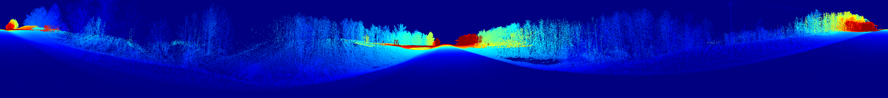

# Occlusion documentation

[Back to README.md](README.md#occlusion)

## Overview

VISTA synthesizes its viewpoints from input point clouds through projecting the point cloud into a 2D image with each pixel being represented by polar coordinates, where each pixel can represent variable depth values. Here we define the culling radius as the radius of pixels from a query pixel of the image defining the neighbourhood that we perform our culling from. (see below for more information)

Multiple points can represented in a pixel, where in VISTA, we take the depth value of the pixel to be either the smallest depth or the largest depth. For our analysis, we priortize the point with the least depth, making that the depth value of the pixel.

Points that are occluded (i.e. not visible) are culled on depending on its depth in comparision with the average depth of the pixel's neighbourhood defined by the culling radius. (see below for a visual representation)

If we were to set the culling radius to 0, we would see outputs as if they were raycasted. It should be noted that VISTA's handling is just a 'second step' for occlusion, as when we convert from a 3D space to a 2D image, some occlusion is handled from raycasting.

### Overview (but in more detail)

Here is the process when it comes to generating VISTA outputs/scenes from the raw point cloud:

1. Given the trajectory, translate and rotate the point cloud, and center it at a road point (see [here](README.md#segmentation)) to obtain the driver's perspective at that frame from ``examples/conversion/single/convert_single.py``.
    - We also cull any points of Euclidean distance greater than the sensor configuration's range just to be lighter on computational resources.

Here is an example of the transformed viewpoint at a certain frame, with the ``veldyne_alpha_128.json`` sensor configuration.

          
          The origin is set to be 1.8m (our observer height) above the pavement in this case.
        

2. Convert the 3D representation of our transformed viewpoint to a 2D image, and take the smallest depth value for each pixel in the ``pcd2sparse()`` method, given in ``vista/entities/sensors/lidar_utils/LidarSynthesis.py``.
    - The image representation depends on the sensor configuration's angular ranges and precisions. If our sensor's horizontal range is 360 degrees, and our vertical range is 40 degrees, with their respective precisions being 0.11 degrees each, our image would be $\lceil\frac{360}{0.11}\rceil$ x $\lceil\frac{40}{0.11}\rceil$, or in other words $3272$ x $364$.
        - There can be multiple depths aggregrated to one pixel in this process, which is why we will take the smallest depth possible for that pixel.

Here is an example image representation, where all of the pixels shown have the smallest depth possible. The colormap shown represents the depth.

          
        

    - Note that when we convert our point cloud, there are two other parameters, or channels that are passed (intensity, and mask). These aren't really that important for occlusion handling, only for outputs.
3. Cull occlusions from this image representation given the culling radius $\lambda$, in the ``cull_occlusions()`` method, given in ``LidarSynthesis.py``.
    - For each pixel location (or query pixel), compute the average depth for all of its neighbours. If the depth of the query pixel, with a slack of 1mm is greater than that of the average depth of its neighbours, then that point is considered as occluded and is culled from the image representation. 

Here is the previous image representation, after culling the occluded points. In this case, we take the culling radius to be 2 pixels.

          
        

    - If we take $\lambda$ as 0, then this would be equivalent to raycasting, which was implemented with the older MATLAB code.
4. Reproject our culled image in 2D space back to 3D coordinates, in the ``synthesize()`` method given in ``LidarSynthesis.py``.

Here is a comparison between the two previously image representations.:

Note that much of the points representing the foliage have been culled, in addition to the culling of points that inherently comes with raycasting. *VISTA's method of culling adds an extra layer of robustness that we can control, depending on the sensor configuration to obtain a more accurate viewpoint.*

And finally, here is a comparison between the two image representations, reprojected to 3D space:

The points in yellow represent the image with culling radius $\lambda=0$ (i.e, no additional occlusion handling), where the white points represent the image with culling radius $\lambda=2$. In this case, we would expect a LiDAR sensor to not see most of the yellow points shown above, as they are already occluded by the vegetation.
