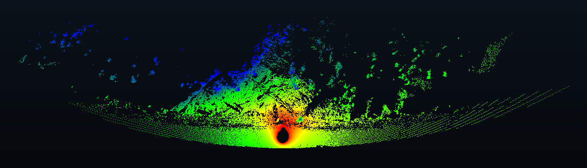
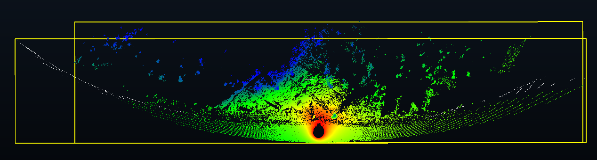
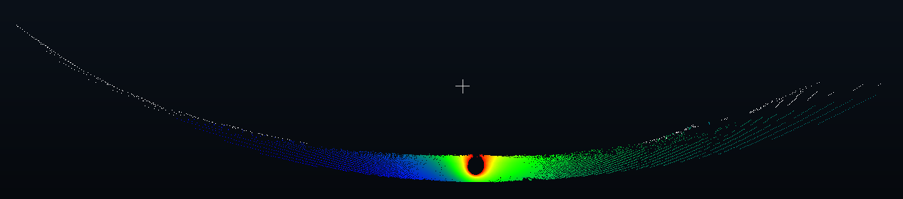

# Output intersection

[Back to README.md](../README.md)

## Overview

This tool obtains identical points between two point clouds, given in plaintext. Useful if you want to visualize the effect of occlusion on horizontal curves (such as with mountains, etc) on the pavement itself. 

For example, let's say that we want to see the pavement that is hidden by the mountain, as opposed to as if it wasn't there.

*Here is a horizontal curve, with a mountain occluding some of the pavement.*

We want to compare pavement in the outputs with the mountain shown above versus pavement without the mountain. Here is the pavement with and without the mountain, as well as their bounding boxes for visualization:

*The points in white represent the points simulated without the mountain, as if there was no occlusion. These points are usually hidden by the mountain, so we want to compare the colored points without the mountain with the pavement points shown by the wider bounding box.*

Basically, as if these two point clouds were sets in the mathematical sense, we want to take the intersection of them; i.e. we want to take the common points between the two:

*The final, intersected output given by the colored points. The white points here are the points that are normally occluded as if the mountain was there.*

### Assumptions

- The two point clouds are given in plaintext format.
- The two point clouds are from the same road section.

### Methodology

We first identify the larger point cloud and the smaller point cloud that we want to compare. In order to identify which points of the larger point cloud are the same (or basically the same) as the smaller point cloud, we perform a k-nearest-neighbours search to the smaller point cloud with the methods given by ``Open3D``.

We then obtain the distances for all points of the larger point cloud to the smaller point cloud through this, and then only take the points where the distances are within a threshold to 'intersect' the two point clouds.

This is done in parallel to speed things up as well.

### Running instructions

I guess that stuff goes here.
